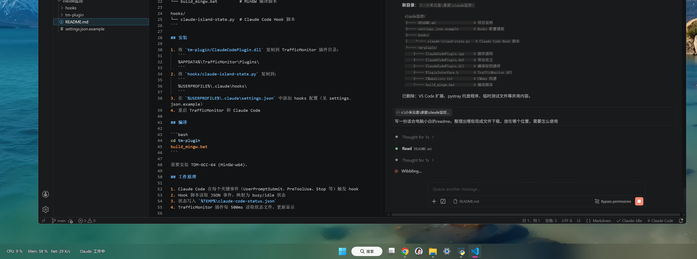

# Claude Code 任务栏状态监控



## 这是什么？

在电脑任务栏实时显示 Claude Code 的运行状态，不用切换窗口就能知道任务进度。

**六种状态：**

| 显示 | 含义 |
|---|---|
| 离线 | Claude 没有启动 |
| 待命 | Claude 刚启动，空闲中 |
| 工作中 | Claude 正在处理任务 |
| 等待回复 | Claude 回复完成，等你下一步指示 |
| 等待批准 | Claude 请求权限执行操作 |
| 出错了 | API 错误导致对话中断 |

## 前提条件

1. **已安装 TrafficMonitor**（一个任务栏网速监控工具）
   - 下载地址：https://github.com/zhongyang219/TrafficMonitor/releases
   - 下载后运行 `TrafficMonitor.exe` 即可

2. **已安装 Claude Code**（VS Code 插件或命令行版）

3. **已安装 Python**（通常已自带）
   - 在命令行输入 `python --version` 能看到版本号就说明已安装

## 安装步骤（共 3 步）

### 第 1 步：放置插件文件

需要把 2 个文件放到指定位置：

#### 文件 ①：`ClaudeCodePlugin.dll`

**来源**：从 [GitHub Release](https://github.com/luochengzhi089757/claudecodemonitor-windows/releases) 下载最新版本

**放到这里**：
1. 按 `Win + R` 打开"运行"对话框
2. 输入 `%APPDATA%\TrafficMonitor\Plugins` 点确定
3. 如果 `Plugins` 文件夹不存在，先新建一个
4. 把 `ClaudeCodePlugin.dll` 复制进去

#### 文件 ②：`claude-island-state.py`

**来源**：从 [GitHub Release](https://github.com/luochengzhi089757/claudecodemonitor-windows/releases) 下载最新版本

**放到这里**：
1. 按 `Win + R` 打开"运行"对话框
2. 输入 `%USERPROFILE%\.claude\hooks` 点确定
3. 如果 `.claude` 或 `hooks` 文件夹不存在，依次新建
4. 把 `claude-island-state.py` 复制进去

### 第 2 步：配置 Claude Code 的 hooks

1. 按 `Win + R`，输入 `%USERPROFILE%\.claude` 点确定
2. 找到 `settings.json` 文件，用记事本或代码编辑器打开
3. 在文件**最末尾的 `}` 前面**，加入以下内容：

```json
"hooks": {
    "UserPromptSubmit": [
        { "hooks": [{ "type": "command", "command": "python \"%USERPROFILE%\\.claude\\hooks\\claude-island-state.py\"" }] }
    ],
    "PreToolUse": [
        { "hooks": [{ "type": "command", "command": "python \"%USERPROFILE%\\.claude\\hooks\\claude-island-state.py\"" }] }
    ],
    "Stop": [
        { "hooks": [{ "type": "command", "command": "python \"%USERPROFILE%\\.claude\\hooks\\claude-island-state.py\"" }] }
    ],
    "SessionStart": [
        { "hooks": [{ "type": "command", "command": "python \"%USERPROFILE%\\.claude\\hooks\\claude-island-state.py\"" }] }
    ],
    "Notification": [
        { "hooks": [{ "type": "command", "command": "python \"%USERPROFILE%\\.claude\\hooks\\claude-island-state.py\"" }] }
    ],
    "PermissionRequest": [
        { "hooks": [{ "type": "command", "command": "python \"%USERPROFILE%\\.claude\\hooks\\claude-island-state.py\"" }] }
    ]
}
```

**注意**：如果 `settings.json` 里已经有 `hooks` 字段，把上面的内容合并进去即可。

如果不会修改 JSON 文件，可以直接复制本文件夹里的 `settings.json.example`，将其内容合并到你的 `settings.json` 中。

### 第 3 步：重启并启用

1. **完全退出 TrafficMonitor**（右键任务栏图标 → 退出）
2. **重新启动 TrafficMonitor**
3. 右键 TrafficMonitor 任务栏显示区域 → **选项设置**
4. 找到"主窗口显示设置"或"任务栏窗口显示设置" → **添加显示项目**
5. 选择 **"Claude Code"** 并确定
6. 重启 Claude Code

## 验证是否成功

打开 Claude Code，发送一条消息，观察任务栏：
- 发消息时 → 显示 **工作中**
- Claude 回复完成后 → 显示 **等待回复**

## 常见问题

**Q：Claude 启动或完成任务时，状态切换会慢半拍？**

正常现象。Claude 启动时会同时触发多个事件（SessionStart、UserPromptSubmit、Stop 等），短时间内状态在"工作中"和"待命"之间频繁切换。为防止任务栏文字闪烁，插件内置了**防抖功能**：需要连续 2 次（约 1 秒）读到相同状态才会更新显示。这意味着状态切换会比实际事件晚约 1 秒，这是正常的，不会持续显示错误状态。

**Q：任务栏没有显示"Claude Code"选项？**
- 确认 `ClaudeCodePlugin.dll` 放到了正确的 `Plugins` 文件夹
- 确认 TrafficMonitor 完全退出后重新启动

**Q：状态一直不变？**
- 检查 `%TEMP%\claude-code-status.json` 是否存在且有内容
- 确认 Python 已安装（命令行运行 `python --version` 测试）

**Q：Claude 启动时就显示"工作中"？**
- 关闭 Claude 后删除 `%TEMP%\claude-code-status.json`
- 重新打开 Claude

## 文件清单

| 文件 | 用途 | 是否需要安装 |
|---|---|---|
| `ClaudeCodePlugin.dll` | TrafficMonitor 插件（必须） | 放到 Plugins 文件夹 |
| `claude-island-state.py` | 状态检测脚本（必须） | 放到 .claude/hooks 文件夹 |
| `settings.json.example` | hooks 配置参考 | 仅作参考，不需放置 |
| `ClaudeCodePlugin.cpp` | 插件源码 | 普通用户不需要 |
| `build_mingw.bat` | 编译脚本 | 普通用户不需要 |

## 工作原理

```
Claude Code 触发事件
       ↓
claude-island-state.py 接收事件
       ↓
写入 %TEMP%\claude-code-status.json
       ↓
TrafficMonitor 插件每 500ms 读取
       ↓
任务栏显示对应状态
```
